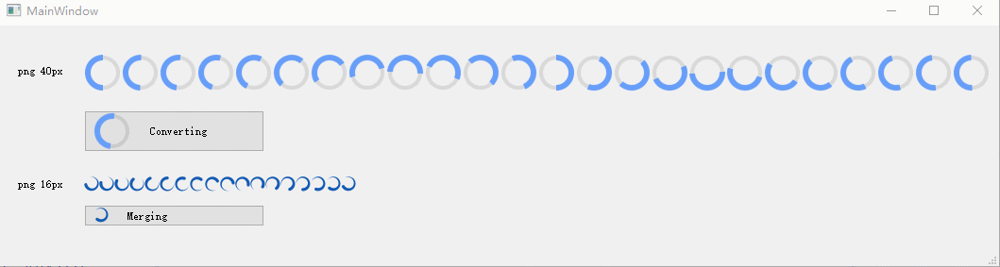

# Animation png

<https://github.com/564398053/QtDisplayPngAsGif>

使用定时器，在Qt项目中，实现将png长图显示为动图



## 使用

拷贝 `buttonicon.h` `buttonicon.cpp` `loadingbutton.cpp` `loadingbutton.h` 到项目中

## 代码示例

参考 源文件中的 `MainWindow::MainWindow(QWidget *parent)`

## API

```c++
    // 是否显示转圈圈
    void LoadingButton::showLoading(bool bShow);

    // 设置正常显示的图标
    void LoadingButton::setIcon(const QString& url);

    // 设置loading图的png
    void LoadingButton::setLoadingPng(const QString& url, int pngWidthPx, int pngHeightPx);

    // 设置文本
    void LoadingButton::setText(const QString &text);
```

## 来源

代码参考自 <https://github.com/QupZilla/qupzilla> 的 TabIcon 的实现

## 其它

也可以使用 <https://github.com/Skycoder42/QtApng> 来显示动图，但是我用了不起作用，因此是自己写代码来实现
